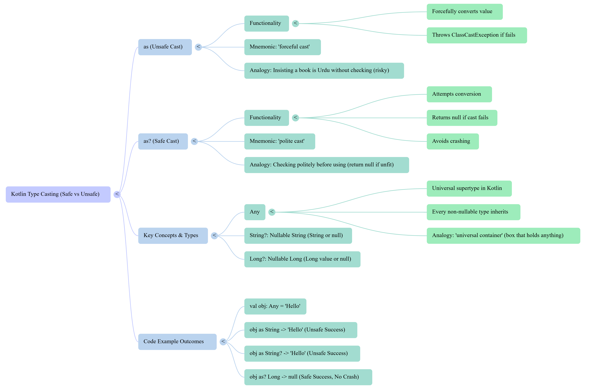
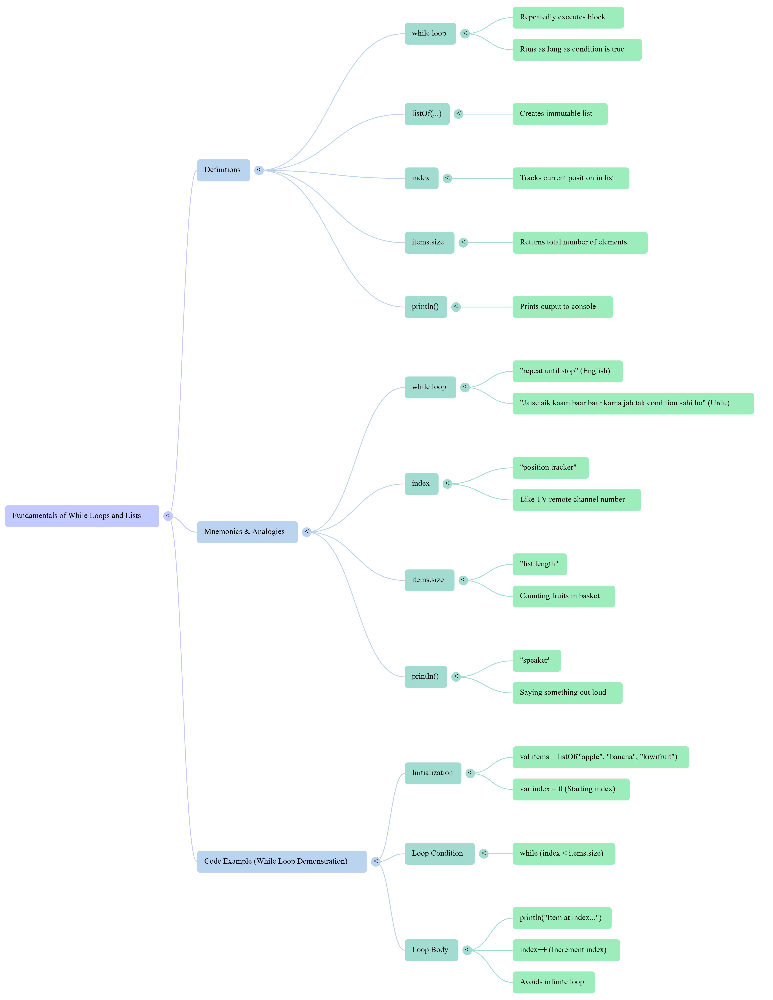
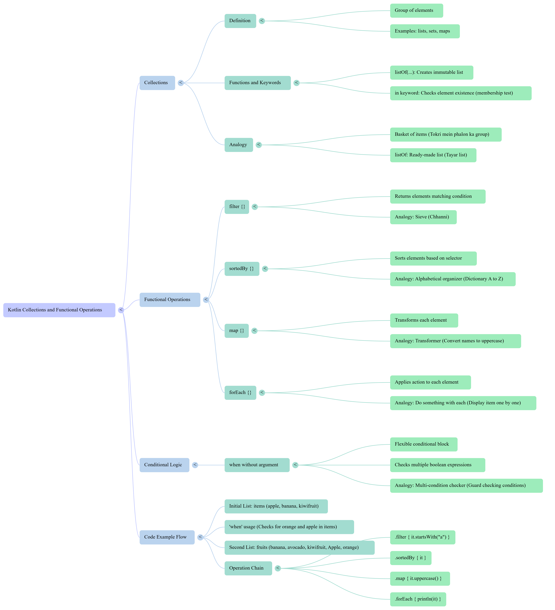

# cosmic-kotlin-bilingual-reference
A beginner-friendly Kotlin reference with bilingual (Urdu–English) explanations, mnemonics, and practical code examples. 🌱
Covers core topics like constructors, null safety, companion objects, and collections — and keeps growing daily as I add new concepts, definitions, and hands-on examples for clearer learning.
## 🔤 Definitions

- **`when` expression**: Kotlin’s powerful replacement for `switch`. It checks a value against multiple conditions.
- **`is` keyword**: Used for **type checking**. It verifies if a variable is of a specific type.
- **`Int`, `String`, `IntArray`**: Built-in Kotlin types for integers, text, and arrays of integers.
- **`println()`**: Prints output to the console.
- **`x + 1`**: Adds 1 to the integer.
- **`x.length + 1`**: Gets the length of the string and adds 1.
- **`x.sum()`**: Calculates the sum of all elements in an integer array.

---

## 🧠 Mnemonics & Analogies (English + Urdu)

- **`when` = "multi-condition gate"**  
  > _"Jaise ek chowk jahan har raasta alag condition ka hai."_  
  Like a traffic junction — each path leads to a different outcome.

- **`is` = "type detector"**  
  > _"Jaise passport check karta hai ke banda Pakistani hai ya nahi."_  
  Like checking someone's passport to confirm their nationality.

- **`?.` = "safe call bell"**  
  > _"Ghanti sirf tab bajti hai jab koi ho."_  
  The bell rings only if someone is present — avoids null crashes.

---

## 💻 Code Example

```kotlin
fun main() {  
    var x = 70

    when(x){
        is Int -> println(x + 1)
        is String -> println(x.length + 1)
        is IntArray -> println(x.sum())
    }
}
```
---

---

## 🔤 Definitions (Safe vs Unsafe cast)

- **`as` (Unsafe Cast)**: Forcefully converts a value to a specific type. If the actual type doesn't match, it throws a `ClassCastException`.
- **`as?` (Safe Cast)**: Attempts to convert a value to a specific type. If the cast fails, it returns `null` instead of crashing.
- **`Any`**: The universal supertype in Kotlin. Every non-nullable type inherits from `Any`.
- **`String?`**: A nullable string — can hold either a string or `null`.
- **`Long?`**: A nullable long integer — can hold a long value or `null`.

---

## 🧠 Mnemonics & Analogies (English + Urdu)

- **`as` = "forceful cast"**  
  > _"Jaise zabardasti kehna 'ye kitab Urdu ki hai' bina dekhe."_  
  Like insisting a book is Urdu without checking — risky and crash-prone.

- **`as?` = "polite cast"**  
  > _"Jaise tameez se pehle dekh lena, agar Urdu hai to padho, warna chhor do."_  
  Like checking politely — if it fits, use it; if not, return `null`.

- **`Any` = "universal container"**  
  > _"Jaise aik box jisme kuch bhi ho sakta hai."_  
  Like a box that can hold anything — string, number, or even an array.

---

## 💻 Code Example

```kotlin
fun main() {  
    val obj: Any = "Hello"

    // Unsafe Cast
    val str: String = obj as String // ✅ Returns "Hello"
    val std: String? = obj as String // ✅ Returns "Hello"

    // Safe Cast
    val num: Long? = obj as? Long // ✅ Returns null, no crash

    println("-= $str $std $num")
}
```
---

---

## 🔤 Definitions (If Expression)

- **`if` statement**: A conditional block that executes code based on whether a condition is true or false.
- **`if-else` block**: Provides two paths — one for `true`, one for `false`.
- **`if` as an expression**: Returns a value directly based on the condition.
- **`val` vs `var`**: `val` is immutable (like `final` in Java), `var` is mutable.
- **`println()`**: Prints output to the console.

---

## 🧠 Mnemonics & Analogies (English + Urdu)

- **`if` = "decision gate"**  
  > _"Jaise aik chowk jahan condition ke mutabiq raasta chunta hai."_  
  Like a junction where the path depends on the condition.

- **`if-else` = "two-way switch"**  
  > _"Jaise bijli ka switch — agar on ho to light, warna andhera."_  
  Like a light switch — either ON or OFF.

- **`if` as expression = "smart shortcut"**  
  > _"Jaise aik sawal ka turant jawab — bina poora essay likhe."_  
  Like giving a direct answer instead of writing a full essay.

---

## 💻 Code Example

```kotlin
fun main() {  
    val a = 10  
    val b = 20  

    // Simple if condition
    var max = a
    if (a < b) max = b

    // Using if-else block
    var max2: Int
    if (a > b) {
        max2 = a
    } else {
        max2 = b
    }

    // Using if as an expression (short form)
    val max3 = if (a > b) a else b

    // Using if as expression with print statements
    val max4 = if (a > b) {
        println("Choose a")
        a
    } else {
        println("Choose b")
        b
    }

    // Display results
    println("max = $max")
    println("max2 = $max2")
    println("max3 = $max3")
    println("max4 = $max4")
}
```

---

## 🔤 Definitions (When Expression)

- **`when`**: Kotlin’s flexible alternative to `switch`. It matches a value or condition against multiple branches.
- **`enum class`**: A special class used to define a fixed set of constants.
- **`in` / `!in`**: Used to check if a value exists inside a range or collection.
- **`is`**: Used for type checking — smart casts allow safe access to properties.
- **`sealed class`**: Restricts class hierarchy to known subclasses — useful for exhaustive `when` expressions.
- **`when as expression`**: Returns a value directly from the matched branch.

---

## 🧠 Mnemonics & Analogies (English + Urdu)

- **`when` = "multi-path decision gate"**  
  > _"Jaise aik chowk jahan har raasta alag condition ka hai."_  
  Like a junction where each path depends on a condition.

- **`enum` = "fixed menu"**  
  > _"Jaise restaurant ka menu — sirf kuch hi options."_  
  Like a restaurant menu — only specific choices allowed.

- **`in` / `!in` = "membership check"**  
  > _"Jaise dekhna ke banda group mein hai ya nahi."_  
  Like checking if someone belongs to a group.

- **`is` = "type passport"**  
  > _"Jaise passport check karta hai ke banda Pakistani hai ya nahi."_  
  Like verifying someone's identity by their type.

- **`sealed class` = "controlled family tree"**  
  > _"Jaise ek khandan jisme sirf kuch hi members allowed hain."_  
  Like a family with limited, known members.

---

## 💻 Code Examples

```kotlin
fun main() {
    val x = 2
    val y = 5
    val s = "5"
    val validNumbers = listOf(2, 4, 6, 8, 10)

    // Example 1 — Simple when statement
    when (x) {
        1 -> println("x == 1")
        2 -> println("x == 2")
        else -> {
            println("x is neither 1 nor 2")
        }
    }

    // Example 2 — when as an expression (else required if not all cases covered)
    enum class Bit { ZERO, ONE }

    fun getRandomBit(): Bit = if (Math.random() > 0.5) Bit.ONE else Bit.ZERO

    val numericValue = when (getRandomBit()) {
        Bit.ZERO -> 0
        Bit.ONE -> 1
    }
    println("Numeric value: $numericValue")

    // Example 3 — when with enums (with and without else)
    enum class Color { RED, GREEN, BLUE }

    fun getColor(): Color = Color.GREEN

    when (getColor()) {
        Color.RED -> println("red")
        Color.GREEN -> println("green")
        Color.BLUE -> println("blue")
    }

    when (getColor()) {
        Color.RED -> println("red")
        else -> println("not red")
    }

    // Example 4 — multiple conditions in one branch
    when (x) {
        0, 1 -> println("x == 0 or x == 1")
        else -> println("otherwise")
    }

    // Example 5 — arbitrary expressions in conditions
    when (x) {
        s.toInt() -> println("s encodes x")
        else -> println("s doesn't encode x")
    }

    // Example 6 — checking ranges and collections
    when (x) {
        in 1..10 -> println("x is in the range 1..10")
        in validNumbers -> println("x is a valid number")
        !in 10..20 -> println("x is outside 10..20")
        else -> println("none of the above")
    }

    // Example 7 — type checking (smart casts)
    fun hasPrefix(x: Any) = when (x) {
        is String -> x.startsWith("prefix")
        else -> false
    }
    println("Has prefix: ${hasPrefix("prefixTest")}")

    // Example 8 — when without argument (condition-based)
    fun Int.isOdd() = this % 2 != 0
    fun Int.isEven() = this % 2 == 0

    when {
        x.isOdd() -> println("x is odd")
        y.isEven() -> println("y is even")
        else -> println("x + y is odd")
    }
}

// Example 9 — when as expression with result handling
// We can capture when subject in a variable using following syntax
sealed class Response
class Success(val body: String) : Response()
class HttpError(val status: Int) : Response()

fun executeRequest(): Response =
    if (Math.random() > 0.5) Success("OK") else HttpError(404)

fun getBody(): String = when (val response = executeRequest()) {
    is Success -> response.body
    is HttpError -> throw Exception("HTTP Error: ${response.status}")
}
```

---

## 🔤 Definitions (Break and Continue)

- **Labeled loop (`loop@`)**: A named loop that allows you to break or continue from outer loops.
- **`break@label`**: Exits the loop with the specified label.
- **`return`**: Exits from a function or lambda.
- **`return@label`**: Performs a local return from a lambda or block with a label.
- **Anonymous function**: A function without a name, often used inside higher-order functions like `forEach`.
- **`run` block**: Executes a block of code and returns its result — can be labeled for controlled exits.

---

## 🧠 Mnemonics & Analogies (English + Urdu)

- **Labeled loop = "named gate"**  
  > _"Jaise har darwaza ka naam ho — taake pata chale kis darwazay se nikalna hai."_  
  Like naming each door so you know exactly which one to exit.

- **`break@label` = "emergency exit from specific gate"**  
  > _"Jaise aik building mein se seedha bahar nikalna — bina andar ke raste follow kiye."_  
  Like exiting a building directly from a specific door.

- **`return` in lambda = "exit from function"**  
  > _"Jaise kisi kaam ko chhor kar seedha ghar chale jaana."_  
  Like abandoning a task and going home immediately.

- **`return@label` = "skip this step only"**  
  > _"Jaise aik sawal chhor kar agla sawal karna — poora paper nahi chhorna."_  
  Like skipping one question without leaving the whole exam.

- **Anonymous function = "nameless helper"**  
  > _"Jaise aik mazdoor jo kaam karta hai bina naam bataye."_  
  Like a worker who does the job without introducing himself.

---

## 💻 Code Example

```kotlin
fun main() {

    // Example 1 — Simple labeled loop (label name = loop)
    loop@ for (i in 1..100) {
        // Do something
        // break@loop or continue@loop can be used here if needed
    }

    // Example 2 — Using break with a label (breaks outer loop)
    loop@ for (i in 1..100) {
        for (j in 1..100) {
            if (i * j > 500) break@loop // exits both loops when condition met
        }
    }

    // Example 3 — Non-local return from lambda (stops whole function)
    fun foo1() {
        listOf(1, 2, 3, 6, 5).forEach {
            if (it == 3) return // exits foo1() completely
            println(it)
        }
        println("this point is unreachable") // never runs
    }

    // Example 4 — Local return using explicit label
    fun foo2() {
        listOf(1, 2, 3, 4, 5).forEach Muhammad@{
            if (it == 3) return@Muhammad // skips only this iteration
            println(it)
        }
        println("done with explicit label")
    }

    // Example 5 — Local return using implicit label (forEach)
    fun foo3() {
        listOf(1, 2, 3, 4, 5).forEach {
            if (it == 3) return@forEach // continues loop, doesn’t exit function
            println(it)
        }
        println("done with implicit label")
    }

    // Example 6 — Local return with anonymous function
    fun foo4() {
        listOf(1, 2, 3, 4, 5).forEach(fun(value: Int) {
            if (value == 3) return // returns only from anonymous function
            println(value)
        })
        println("done with anonymous function")
    }

    // Example 7 — Using run block with label
    fun foo5() = run loop@{
        listOf(1, 2, 3, 4, 5).forEach {
            if (it == 3) return@loop // exits run block, not main
            print(it)
        }
    }

    // Call all examples
    foo1()
    foo2()
    foo3()
    foo4()
    foo5()
    println("\nAll loops completed.")
}
```

---

## 🔤 Definitions (Function)

- **Function**: A reusable block of code that performs a specific task.
- **Parameters**: Inputs passed to a function to customize its behavior.
- **String Interpolation (`$var`, `${expression}`)**: Embeds variables or expressions directly inside strings.
- **`Unit`**: Kotlin’s equivalent of `void` in Java — indicates no meaningful return value.
- **Default Parameter**: A parameter with a pre-defined value used when no argument is passed.
- **Expression Body**: A concise way to define functions using `=` instead of `return`.

---

## 🧠 Mnemonics & Analogies (English + Urdu)

- **Function = "reusable machine"**  
  > _"Jaise aik chhoti factory jo har baar wahi kaam karti hai."_  
  Like a mini factory that performs the same task every time.

- **Parameters = "custom ingredients"**  
  > _"Jaise biryani mein mirch aur namak — har baar alag ho sakta hai."_  
  Like spices in biryani — you can adjust them each time.

- **String Interpolation = "inline printing"**  
  > _"Jaise sentence ke andar naam ghusa dena."_  
  Like inserting a name directly into a sentence.

- **`Unit` = "no return gift"**  
  > _"Kaam ho gaya, lekin kuch wapas nahi mila."_  
  Task completed, but nothing is returned.

- **Default Parameter = "backup value"**  
  > _"Agar user kuch na de to system apna value use karega."_  
  If no input is given, the system uses its own value.

- **Expression Body = "shortcut function"**  
  > _"Jaise ek line mein kaam nipta dena."_  
  Like finishing a task in one line.

---

## 💻 Code Example

```kotlin
fun main() {

    // Example 1 — Function with parameters and string interpolation
    fun printSum(a: Int, b: Int) {
        println("Sum of $a and $b is ${a + b}")
    }

    // Example 2 — Function returning Unit (like void in Java)
    fun printMessage(message: String): Unit {
        println(message)
    }

    // Example 3 — Function with a default parameter value
    fun printMessageWithPrefix(message: String, prefix: String = "Info") {
        println("[$prefix] $message")
    }

    // Example 4 — Function returning an Int explicitly
    fun sum(x: Int, y: Int): Int {
        return x + y
    }

    // Example 5 — Function with expression body (no need for 'return')
    fun multiply(x: Int, y: Int) = x * y

    // Example calls
    printSum(3, 7)
    printMessage("Hello, Kotlin!")
    printMessageWithPrefix("System starting...")
    printMessageWithPrefix("Low battery", "Warning")
    println("Sum result: ${sum(5, 8)}")
    println("Multiply result: ${multiply(4, 6)}")
}
```

---

## 🔤 Definitions (Overriding Methods)

- **`open`**: Marks a class or member as extendable or overridable.
- **`override`**: Replaces a superclass method or property with a new implementation in the subclass.
- **Base class**: A parent class that defines common behavior or structure.
- **Subclass**: A child class that inherits from a base class and can customize or extend its behavior.
- **Property overriding**: Changing the value or behavior of a property defined in a superclass.
- **Function overriding**: Replacing a method from the superclass with a new version in the subclass.

---

## 🧠 Mnemonics & Analogies (English + Urdu)

- **`open` = "permission to customize"**  
  > _"Jaise aik recipe jisme likha ho 'aap masalay badal sakte hain'."_  
  Like a recipe that allows you to change the spices.

- **`override` = "custom version"**  
  > _"Jaise aik student ne apna tareeqa apna liya — asal tareeqa chhor kar."_  
  Like a student using their own method instead of the original one.

- **Base class = "parent blueprint"**  
  > _"Jaise aik ghar ka naqsha jo sab ko diya gaya."_  
  Like a blueprint shared with all builders.

- **Subclass = "customized child"**  
  > _"Jaise har bacha apne tareeqay se kaam karta hai — asal se seekh kar."_  
  Like a child who learns from the parent but adds their own style.

- **Property overriding = "updated trait"**  
  > _"Jaise asal mein teen kone thay, lekin rectangle ne chaar kar diye."_  
  Like changing the number of corners from triangle to rectangle.

---

## 💻 Code Example

```kotlin
fun main() {

    // Example 1 — Base class with open functions
    open class Shape {
        open fun draw() {              // can be overridden
            println("Drawing a generic shape")
        }

        fun fill() {                   // not open → cannot be overridden
            println("Filling the shape")
        }
    }

    // Example 2 — Subclass overriding the function
    class Circle : Shape() {
        override fun draw() {          // overrides draw() from Shape
            println("Drawing a circle")
        }
    }

    // Example 3 — Overriding properties
    open class Polygon : Shape() {
        open val vertexCount: Int = 3  // open property for overriding
        override fun draw() {          // can still override draw()
            println("Drawing a polygon with $vertexCount vertices")
        }
    }

    class Rectangle : Polygon() {
        override val vertexCount: Int = 4   // override property value
        override fun draw() {               // override function again
            println("Drawing a rectangle with $vertexCount vertices")
        }
    }

    // Example 4 — Using the classes
    val shape = Shape()
    val circle = Circle()
    val polygon = Polygon()
    val rectangle = Rectangle()

    shape.draw()
    shape.fill()

    circle.draw()

    polygon.draw()
    rectangle.draw()

    println("Rectangle vertex count: ${rectangle.vertexCount}")
}
```

---

## 🔤 Definitions (Extension Function)

- **Extension Function**: A way to add new functionality to existing classes without modifying their source code.
- **`this` keyword**: Refers to the current object — in extension functions, it refers to the receiver (e.g., the list).
- **Generic Function (`<T>`)**: A function that works with any type, making it reusable and type-safe.
- **MutableList**: A list that allows modification — adding, removing, or updating elements.

---

## 🧠 Mnemonics & Analogies (English + Urdu)

- **Extension Function = "add-on skill"**  
  > _"Jaise aik aadmi ko nayi skill sikhana bina uski asal shakl badle."_  
  Like teaching someone a new skill without changing who they are.

- **`this` = "current object pointer"**  
  > _"Jaise 'main khud' — jab koi banda apne baare mein baat karta hai."_  
  Like saying “I myself” — refers to the current object.

- **Generic Function = "universal tool"**  
  > _"Jaise aik screwdriver jo har size ke bolt ko khol sakta hai."_  
  Like a screwdriver that fits any bolt size.

- **MutableList = "editable notebook"**  
  > _"Jaise aik diary jisme aap kuch bhi likh sakte hain, mita sakte hain."_  
  Like a diary where you can write, erase, and update freely.

---

## 💻 Code Example

```kotlin
fun main() {

    // Example 1 — Extension function for MutableList<Int>
    fun MutableList<Int>.swap(index1: Int, index2: Int) {
        val tmp = this[index1]       // 'this' refers to the list itself
        this[index1] = this[index2]  // swap values
        this[index2] = tmp
    }

    // Using the Int-specific version
    val intList = mutableListOf(1, 2, 3)
    println("Before swap (Int list): $intList")
    intList.swap(0, 2)               // swaps first and last
    println("After swap (Int list):  $intList\n")


    // Example 2 — Generic version (works for any type)
    fun <T> MutableList<T>.swap(index1: Int, index2: Int) {
        val tmp = this[index1]       // 'this' refers to the current list
        this[index1] = this[index2]
        this[index2] = tmp
    }

    // Using the generic version with Strings
    val stringList = mutableListOf("A", "B", "C")
    println("Before swap (String list): $stringList")
    stringList.swap(0, 2)            // swaps "A" and "C"
    println("After swap (String list):  $stringList")
}
```

---

## 🔤 Definitions (Classes)

- **`open` class**: Allows other classes to inherit from it. By default, Kotlin classes are final and cannot be extended.
- **Primary constructor**: The main constructor declared in the class header. Used for initializing properties.
- **Secondary constructor**: An optional constructor declared inside the class body for alternative initialization.
- **Constructor injection**: A technique where dependencies are passed directly into the constructor — often used in frameworks.
- **Property declaration in constructor**: Kotlin allows concise property initialization directly in the constructor.
- **Default parameter value**: A value assigned to a parameter if no argument is provided during object creation.

---

## 🧠 Mnemonics & Analogies (English + Urdu)

- **`open` = "permission to inherit"**  
  > _"Jaise aik teacher ne kaha 'ye notes sab copy kar sakte hain'."_  
  Like a teacher allowing everyone to copy the notes.

- **Primary constructor = "main entry gate"**  
  > _"Jaise ghar ka main darwaza — sabse pehla raasta andar aane ka."_  
  Like the main door to a house — the primary way to enter.

- **Secondary constructor = "side gate"**  
  > _"Jaise garage ka raasta — alternative tareeqa andar aane ka."_  
  Like a side entrance — an alternative way to enter.

- **Constructor injection = "ready-made delivery"**  
  > _"Jaise pizza order ke sath toppings already aa jayein."_  
  Like getting a pizza with toppings already included.

- **Property declaration in constructor = "one-line setup"**  
  > _"Jaise aik hi line mein naam, umar aur kaam likh diya jaye."_  
  Like writing name, age, and job in one line.

- **Default value = "backup plan"**  
  > _"Agar user kuch na de to system apna value use karega."_  
  If no input is given, the system uses its own value.

---

## 💻 Code Example

```kotlin
fun main() {
    // 'open' allows other classes to inherit this class
    open class Shape

    // 'Rectangle' extends 'Shape' and has two properties: height and length
    class Rectangle(var height: Double, var length: Double) : Shape() {
        var perimeter = (height + length) * 2  // property for perimeter
    }

    // A simple class with a primary constructor
    class Person constructor(firstName: String) {
        /*...*/
    }

    // Example of constructor injection (useful in dependency injection frameworks)
    class Customer @Inject constructor(name: String) {
        /*...*/
    }

    // Another class example with a primary constructor
    class Person1(firstName: String) {
        /*...*/
    }

    // Class with multiple properties in primary constructor
    class Person2(val firstName: String, val lastName: String, var age: Int)

    // Class with a default value for a property
    class Person3(val firstName: String, val lastName: String, var isEmployed: Boolean = true)

    // Example usage:
    val rect = Rectangle(5.0, 10.0)
    println("Perimeter of rectangle: ${rect.perimeter}")
}
```
---

---

## 🔤 Definitions (Secondary constructor)

- **Primary constructor**: The main constructor declared in the class header, used to initialize properties.
- **Secondary constructor**: An optional constructor declared inside the class body for alternative initialization logic.
- **`init` block**: A special block that runs immediately when an object is created — before any secondary constructor.
- **Private constructor**: A constructor that restricts object creation from outside the class.
- **Constructor chaining**: When a secondary constructor calls the primary constructor using `: this(...)`.
- **MutableList**: A list that can be modified — elements can be added, removed, or updated.

---

## 🧠 Mnemonics & Analogies (English + Urdu)

- **Primary constructor = "main gate"**  
  > _"Jaise ghar ka asal darwaza — sabse pehla raasta andar aane ka."_  
  Like the main entrance of a house — the default way to enter.

- **Secondary constructor = "side gate"**  
  > _"Jaise garage ka raasta — alternative tareeqa andar aane ka."_  
  Like a side entrance — used when extra setup is needed.

- **`init` block = "welcome message"**  
  > _"Jaise ghar mein ghusne par pehle salam hoti hai."_  
  Like a greeting that happens as soon as someone enters.

- **Private constructor = "no entry allowed"**  
  > _"Jaise aik locked room — sirf andar se khula ja sakta hai."_  
  Like a locked room — only accessible internally.

- **Constructor chaining = "one setup calls another"**  
  > _"Jaise ek kaam karne se doosra kaam bhi ho jaye."_  
  Like doing one task that automatically triggers another.

- **MutableList = "editable diary"**  
  > _"Jaise aik diary jisme naye log likhe ja sakte hain."_  
  Like a diary where new entries (children) can be added.

---

## 💻 Code Example

```kotlin
fun main() {

    // Class with primary and secondary constructors
    class Person(val name: String) {

        // Each person can have children (list of Person objects)
        val children: MutableList<Person> = mutableListOf()

        // Secondary constructor — adds this new person to the parent's children list
        constructor(name: String, parent: Person) : this(name) {
            parent.children.add(this)
        }
    }

    // Class with primary and secondary constructors
    class Constructors {

        // init block runs whenever an instance is created
        init {
            println("Primary constructor called (no parameters)")
        }

        // Secondary constructor
        constructor(i: Int) {
            println("Secondary constructor called with value: $i")
        }
    }

    // Example of a class with private constructor (cannot be instantiated outside)
    class DontCreateMe private constructor() {
        /*...*/
    }

    // --- Example Usage ---
    val parent = Person("Alice")
    val child = Person("Bob", parent)
    println("${parent.name}'s children: ${parent.children.map { it.name }}")

    val obj1 = Constructors()
    val obj2 = Constructors(10)
}
```
---

---

## 🔤 Definitions (Data Classes)

- **`data class`**: A special class in Kotlin designed to hold data. It automatically generates utility methods.
- **`toString()`**: Returns a readable string representation of the object.
- **`equals()`**: Compares two objects for equality based on their properties.
- **`hashCode()`**: Generates a hash value used in hashing structures like maps and sets.
- **`copy()`**: Creates a new object with modified properties while keeping others unchanged.
- **`componentN()`**: Enables destructuring declarations (e.g., `val (name, age) = user`).

---

## 🧠 Mnemonics & Analogies (English + Urdu)

- **`data class` = "smart container"**  
  > _"Jaise aik dabba jo apne andar ki cheezon ka pura record rakhta hai."_  
  Like a box that keeps track of everything inside — name, age, etc.

- **`toString()` = "self-introduction"**  
  > _"Jaise banda apna naam aur umar bata raha ho."_  
  Like someone introducing themselves with name and age.

- **`copy()` = "clone with change"**  
  > _"Jaise photocopy kar ke sirf aik cheez badal dena."_  
  Like making a copy and changing just one detail.

- **`equals()` = "identity check"**  
  > _"Jaise do ID cards compare karna — dono same hain ya nahi."_  
  Like comparing two ID cards to see if they match.

- **Destructuring = "split and assign"**  
  > _"Jaise aik box khol kar alag alag cheezein nikaal lena."_  
  Like unpacking a box and assigning each item to a variable.

---

## 💻 Code Example

```kotlin
fun main() {

    /*
     * Data classes are used to hold data.
     * Kotlin automatically generates useful methods such as:
     * - toString()  → for readable object output
     * - equals()    → for object comparison
     * - hashCode()  → for hashing
     * - copy()      → for creating modified copies
     * - componentN() functions for destructuring
     */
    data class User(val name: String, val age: Int)

    // Creating an object of the data class
    val user1 = User("Muhammad", 19)

    // Printing object (uses auto-generated toString())
    println(user1)

    // Copying with modification
    val user2 = user1.copy(age = 20)

    // Comparing two data objects (uses auto-generated equals())
    println(user1 == user2)

    // Destructuring declaration
    val (name, age) = user2
    println("Name: $name, Age: $age")
}
```
---

---

## 🔤 Definitions (Interfaces)

- **Interface**: A blueprint or contract that defines functions a class must implement.
- **`fun foo()`**: A function declared in the interface without a body — must be implemented by the class.
- **`fun bar()`**: A function with a default body — optional for the implementing class to override.
- **`override`**: A keyword used to provide a custom implementation of a function defined in an interface or superclass.
- **Implementation**: The actual code written in a class to fulfill the contract defined by the interface.

---

## 🧠 Mnemonics & Analogies (English + Urdu)

- **Interface = "contract or promise"**  
  > _"Jaise aik agreement jisme likha ho ke kya kaam karna hai."_  
  Like a contract that says what tasks must be done.

- **Function without body = "must-do task"**  
  > _"Jaise boss ne kaha 'ye kaam zaroor karna hai' — detail baad mein tum likho."_  
  Like a boss assigning a task — you must decide how to do it.

- **Function with body = "optional helper"**  
  > _"Jaise boss ne example bhi de diya — agar chaho to use karo."_  
  Like a boss giving a sample solution — you can use it or write your own.

- **`override` = "custom execution"**  
  > _"Jaise kisi kaam ka apna tareeqa apna lena."_  
  Like doing a task your own way instead of the default.

---

## 💻 Code Example

```kotlin
// Defining an interface — a contract that classes can implement
interface MyInterface {

    // Default method with implementation (optional)
    fun bar() {
        println("bar() function with default body")
    }

    // Abstract method (must be implemented by any class that implements this interface)
    fun foo()
}

// A class implementing the interface
class MyClass : MyInterface {
    // Must override foo() because it has no default implementation
    override fun foo() {
        println("foo() function implemented in MyClass")
    }
}

// Main function to test interface implementation
fun main() {
    val obj = MyClass()  // Create object of MyClass
    obj.foo()             // Calls overridden function
    obj.bar()             // Calls default function from interface
}
```
---

---

## 🔤 Definitions (Implementation)

- **Interface**: A contract that defines behaviors (functions) a class must follow.
- **Default implementation**: A function inside an interface that already has a body — can be used as-is or overridden.
- **`override`**: A keyword used to replace the default behavior with a custom one in the implementing class.
- **Implementing class**: A class that agrees to follow the interface and provide its own versions of the required functions.

---

## 🧠 Mnemonics & Analogies (English + Urdu)

- **Interface = "behavior contract"**  
  > _"Jaise aik job description — har employee ko follow karna hota hai."_  
  Like a job description — every employee must follow it.

- **Default implementation = "ready-made solution"**  
  > _"Jaise boss ne kaam ka tareeqa bhi bata diya — chaho to apna tareeqa use karo."_  
  Like a boss giving a suggested method — you can use it or customize it.

- **Override = "custom behavior"**  
  > _"Jaise aik chef ne apni recipe mein thoda twist daal diya."_  
  Like a chef adding their own twist to a standard recipe.

- **Implementing class = "contract follower"**  
  > _"Jaise aik student jo school ke rules follow karta hai."_  
  Like a student who follows the school’s rules.

---

## 💻 Code Example

```kotlin
// Define an interface (a contract of behaviors)
interface MyInterface {

    // Function with a default implementation
    fun bar() {
        println("Default bar() from MyInterface")
    }
}

// Class implementing the interface
class Child : MyInterface {

    // Overriding the interface function
    override fun bar() {
        println("bar() overridden in Child class")
    }
}

// Main function — program entry point
fun main() {
    val obj = Child()  // Create object of Child
    obj.bar()          // Calls overridden version from Child
}
```
---

---

## 🔤 Definitions (Properties in Interface)

- **Interface**: A contract that defines abstract and optionally implemented members (functions or properties).
- **Abstract property**: A property declared without a body — must be implemented by the class.
- **Property with implementation**: A read-only property inside an interface that provides a default value.
- **`override`**: Used to provide a concrete implementation of abstract members from an interface or superclass.
- **Interface function using property**: Functions in interfaces can access both abstract and implemented properties.

---

## 🧠 Mnemonics & Analogies (English + Urdu)

- **Interface = "rulebook with examples"**  
  > _"Jaise aik kitab jisme kuch kaam karne ke tareeqay likhe hain — kuch sirf headings, kuch poore."_  
  Like a manual where some tasks are just listed, others are fully explained.

- **Abstract property = "must-fill blank"**  
  > _"Jaise form mein khaali jagah — har banda apna jawab likhe."_  
  Like a blank in a form — everyone must fill it in.

- **Property with implementation = "default answer"**  
  > _"Jaise form mein kuch fields pehle se bharay huay hon."_  
  Like pre-filled fields in a form — you can use them as-is.

- **`override` = "personalized version"**  
  > _"Jaise kisi ne asal tareeqa chhor kar apna naya tareeqa likh diya."_  
  Like replacing the default method with your own.

- **Interface function using property = "template with variables"**  
  > _"Jaise aik sentence jisme naam aur umar insert karni ho."_  
  Like a sentence that uses variables to complete itself.

---

## 💻 Code Example

```kotlin
// Interface can contain both abstract and concrete (implemented) properties and functions
interface MyInterface {

    // Abstract property — must be implemented by the class
    val prop: Int

    // Property with default implementation (read-only)
    val propertyWithImplementation: String
        get() = "foo"

    // Function using the abstract property
    fun foo() {
        println(prop)
    }
}

// Class implementing the interface
class Child : MyInterface {

    // Must override abstract property 'prop'
    override val prop: Int = 29
}

// Main function — program entry point
fun main() {
    val obj = Child()         // Create object of Child
    obj.foo()                 // Calls foo() → prints prop value (29)
    println(obj.propertyWithImplementation) // Accesses implemented property "foo"
}
```
---

---

## 🔤 Definitions (Comments)

- **Single-line comment (`//`)**: Used to add short notes or explanations on a single line.
- **Block comment (`/* ... */`)**: Used for multi-line explanations or to temporarily disable code blocks.
- **Documentation comment (`/** ... */`)**: Known as KDoc in Kotlin — used to generate API documentation for classes, functions, and parameters.
- **Inline comment**: A comment written on the same line as a statement, typically to explain that specific line.

---

## 🧠 Mnemonics & Analogies (English + Urdu)

- **Single-line comment = "quick whisper"**  
  > _"Jaise kisi line ke saath chhoti si baat likh dena."_  
  Like whispering a quick note beside a sentence.

- **Block comment = "sticky note on code"**  
  > _"Jaise aik bara sticky note jo poora code block cover karta hai."_  
  Like placing a sticky note over a whole section of code.

- **Documentation comment = "official label"**  
  > _"Jaise kisi file ke upar likha ho 'ye kya karta hai' taake doosre samajh saken."_  
  Like labeling a file with its purpose so others can understand it.

- **Inline comment = "side note"**  
  > _"Jaise kisi jumlay ke baad zara si wazahat likhna."_  
  Like adding a small side note after a sentence.

---

## 💻 Code Example

```kotlin
// Comments

// This is an end-of-line comment (single line)

/*
   This is a block comment
   that spans multiple lines.
   Useful for disabling or explaining code blocks.
*/

/**
 * This is a documentation comment (KDoc)
 * Used for generating documentation automatically.
 * Example: functions, classes, parameters, etc.
 */

fun main() {
    // You can add inline comments inside code too
    println("Hello, Kotlin!") // Prints greeting message
}
```
---

---

## 🔤 Definitions (Conditions)

- **Condition (`if-else`)**: A control structure that checks whether a statement is true or false and executes code accordingly.
- **Function (`fun`)**: A reusable block of code that performs a specific task.
- **Return statement**: Sends back a result from a function to the caller.
- **Comparison operator (`>`)**: Checks if one value is greater than another.

---

## 🧠 Mnemonics & Analogies (English + Urdu)

- **Condition = "decision gate"**  
  > _"Jaise aik chowk jahan condition ke mutabiq raasta chunta hai."_  
  Like a junction where the path depends on the condition.

- **Function = "task machine"**  
  > _"Jaise aik chhoti factory jo har baar wahi kaam karti hai."_  
  Like a mini factory that performs the same task every time.

- **Return = "final answer delivery"**  
  > _"Jaise exam ke baad result wapas milta hai."_  
  Like receiving your result after an exam.

- **`>` operator = "greater than check"**  
  > _"Jaise do numbers ka muqabala — kaun bara hai."_  
  Like comparing two numbers to see which one is bigger.

---

## 💻 Code Example

```kotlin
fun main() {
    // Conditions
    // Function to find the maximum of two numbers
    fun maxOf(a: Int, b: Int): Int {
        // If 'a' is greater than 'b', return 'a'
        if (a > b) {
            return a
        } 
        // Otherwise, return 'b'
        else {
            return b
        }
    }

    // Example usage
    val result = maxOf(10, 5)
    println("The maximum number is $result")
}
```
---

---

## 🔤 Definitions (For Loop)

- **`for` loop**: A control structure used to iterate over elements in a collection.
- **`listOf(...)`**: Creates an immutable list of elements.
- **`indices`**: A property that returns the valid index range of a list.
- **`forEach`**: A Kotlin-style higher-order function that applies an action to each element in a collection.
- **`println()`**: Prints output to the console.

---

## 🧠 Mnemonics & Analogies (English + Urdu)

- **`for` loop = "repeating reader"**  
  > _"Jaise aik aadmi har item ko ek ek kar ke padhta hai."_  
  Like someone reading each item one by one.

- **`indices` = "index map"**  
  > _"Jaise har item ka number likha ho — 0, 1, 2."_  
  Like numbering each item in a list.

- **`forEach` = "Kotlin-style loop"**  
  > _"Jaise har fruit ko ek tareeqay se handle karna — bina index ke."_  
  Like handling each fruit directly without worrying about its position.

- **`listOf(...)` = "fruit basket"**  
  > _"Jaise aik tokri mein sab fruits rakh diye gaye."_  
  Like placing all fruits in a basket.

- **`println()` = "speaker"**  
  > _"Jaise koi cheez bol kar sunai jaye."_  
  Like saying something out loud.

---

## 💻 Code Example

```kotlin
fun main() {

    // Example 1: Simple for-loop over a list
    val fruits = listOf("apple", "banana", "kiwifruit")
    for (item in fruits) { 
        println(item) // Prints each fruit in the list
    }

    // Example 2: Using index with 'indices' property
    for (index in fruits.indices) {
        // Access element using index
        println("Item at index $index is ${fruits[index]}")
    }

    // Example 3: Using forEach loop (more Kotlin-style)
    fruits.forEach { fruit ->
        println("Fruit name: $fruit")
    }
}
```
---

---

## 🔤 Definitions (Range)

- **Range (`1..5`)**: A sequence of values from a starting number to an ending number (inclusive).
- **`downTo`**: Creates a descending range from a higher number to a lower one.
- **`step`**: Skips values in the range by a fixed interval.
- **`until`**: Creates a range that excludes the upper limit.
- **`in` / `!in`**: Used to check if a value exists inside or outside a range.

---

## 🧠 Mnemonics & Analogies (English + Urdu)

- **Range = "number line"**  
  > _"Jaise 1 se 5 tak ginti likhna."_  
  Like writing numbers from 1 to 5.

- **`downTo` = "reverse counting"**  
  > _"Jaise 5 se 1 tak ulta ginna."_  
  Like counting backwards from 5 to 1.

- **`step` = "skip mode"**  
  > _"Jaise har doosra number lena — 1, 3, 5."_  
  Like picking every second number — 1, 3, 5.

- **`until` = "stop before limit"**  
  > _"Jaise 5 tak na jao — 4 pe ruk jao."_  
  Like stopping at 4 instead of reaching 5.

- **`in` / `!in` = "membership check"**  
  > _"Jaise dekhna ke koi number group mein hai ya nahi."_  
  Like checking if a number belongs to a group or not.

---

## 💻 Code Example

```kotlin
fun main() {

    // Example 1: Range from 1 to 5 (inclusive)
    for (i in 1..5) {
        println(i) // Prints: 1, 2, 3, 4, 5
    }

    // Example 2: Range in reverse using downTo
    for (i in 5 downTo 1) {
        println(i) // Prints: 5, 4, 3, 2, 1
    }

    // Example 3: Range with step (skipping numbers)
    for (i in 1..5 step 2) {
        println(i) // Prints: 1, 3, 5
    }

    // Example 4: Reverse range with step
    for (i in 5 downTo 1 step 2) {
        println(i) // Prints: 5, 3, 1
    }

    // Example 5: Range using 'until' (excludes upper limit)
    for (i in 0 until 5) {
        println(i) // Prints: 0, 1, 2, 3, 4
    }

    // Example 6: Using range in condition check
    val x = 2

    if (x in 1..5) {
        println("x is in the range from 1 to 5")
    }

    if (x !in 6..10) {
        println("x is not in the range from 6 to 10")
    }
}
```

---

## 🔤 Definitions (While loop)

- **`while` loop**: A control structure that repeatedly executes a block of code as long as a condition remains true.
- **`listOf(...)`**: Creates an immutable list of elements.
- **`index`**: A variable used to track the current position in a list.
- **`items.size`**: Returns the total number of elements in the list.
- **`println()`**: Prints output to the console.

---

## 🧠 Mnemonics & Analogies (English + Urdu)

- **`while` loop = "repeat until stop"**  
  > _"Jaise aik kaam baar baar karna jab tak condition sahi ho."_  
  Like repeating a task until the condition says stop.

- **`index` = "position tracker"**  
  > _"Jaise TV remote ka channel number — har waqt batata hai ke kahan ho."_  
  Like a TV remote showing the current channel number.

- **`items.size` = "list length"**  
  > _"Jaise fruit basket mein kitne fruits hain — gin kar batana."_  
  Like counting how many fruits are in the basket.

- **`println()` = "speaker"**  
  > _"Jaise koi cheez bol kar sunai jaye."_  
  Like saying something out loud.

---

## 💻 Code Example

```kotlin
fun main() {

    // Example: While loop demonstration
    val items = listOf("apple", "banana", "kiwifruit") // List of fruits
    var index = 0 // Starting index

    // While loop runs as long as the condition is true
    while (index < items.size) {
        println("Item at index $index is ${items[index]}") // Prints item with index
        index++ // Increment index to avoid infinite loop
    }
}
```
---

---

## 🔤 Definitions (When)

- **`when` expression**: Kotlin’s flexible replacement for `switch`, used for matching values, types, or conditions.
- **`is Type`**: Checks if a value is of a specific type.
- **`!is Type`**: Checks if a value is *not* of a specific type.
- **`Any`**: The root type of all non-nullable types in Kotlin — can hold any object.
- **`else`**: Acts as a fallback when no other branch matches.

---

## 🧠 Mnemonics & Analogies (English + Urdu)

- **`when` = "multi-path decision gate"**  
  > _"Jaise aik chowk jahan har raasta alag condition ka hai."_  
  Like a junction where each path depends on a condition.

- **`is Type` = "ID card check"**  
  > _"Jaise dekhna ke banda student hai ya teacher."_  
  Like checking if someone is a student or a teacher.

- **`!is Type` = "not that category"**  
  > _"Jaise kehna ke ye banda doctor nahi hai."_  
  Like saying someone doesn’t belong to a certain category.

- **`Any` = "universal container"**  
  > _"Jaise aik box jisme kuch bhi ho sakta hai."_  
  Like a box that can hold anything.

- **`else` = "default backup"**  
  > _"Agar koi condition match na kare to ye kaam karo."_  
  If nothing matches, do this instead.

---

## 💻 Code Example

```kotlin
fun main() {

    // 'when' expression example
    fun describe(obj: Any): String = when (obj) {
        1 -> "One"                   // Matches number 1
        "Hello" -> "Greeting"        // Matches string "Hello"
        is Long -> "Long"            // Checks if obj is of type Long
        !is String -> "Not a String" // Checks if obj is NOT a String
        else -> "Unknown"            // Default case for anything else
    }

    // Testing the function with different values
    println(describe(1))
    println(describe("Hello"))
    println(describe(1000L))
    println(describe(2.5))
    println(describe("Kotlin"))
}
```
---

---

## 🔤 Definitions (Collections)

- **Collection**: A group of elements like lists, sets, or maps.
- **`listOf(...)`**: Creates an immutable list of elements.
- **`when` without argument**: A flexible conditional block that checks multiple boolean expressions.
- **`in` keyword**: Checks if an element exists in a collection.
- **`filter {}`**: Returns only the elements that match a given condition.
- **`sortedBy {}`**: Sorts elements based on a given selector.
- **`map {}`**: Transforms each element in a collection.
- **`forEach {}`**: Applies an action to each element in a collection.

---

## 🧠 Mnemonics & Analogies (English + Urdu)

- **Collection = "basket of items"**  
  > _"Jaise aik tokri mein phalon ka group."_  
  Like a basket filled with fruits.

- **`listOf(...)` = "ready-made list"**  
  > _"Jaise ek tayar list jisme cheezein likhi hui hain."_  
  Like a pre-written list of items.

- **`when` without argument = "multi-condition checker"**  
  > _"Jaise aik guard jo har condition alag alag check karta hai."_  
  Like a guard checking multiple conditions one by one.

- **`in` = "membership test"**  
  > _"Jaise dekhna ke koi fruit tokri mein hai ya nahi."_  
  Like checking if a fruit is in the basket.

- **`filter` = "sieve"**  
  > _"Jaise chhanni jo sirf chhoti cheezein nikalti hai."_  
  Like a sieve that only lets specific items through.

- **`sortedBy` = "alphabetical organizer"**  
  > _"Jaise dictionary mein words A to Z ke hisaab se hon."_  
  Like arranging words alphabetically in a dictionary.

- **`map` = "transformer"**  
  > _"Jaise har fruit ka naam capital letters mein badal dena."_  
  Like converting each fruit name to uppercase.

- **`forEach` = "do something with each"**  
  > _"Jaise har item ko alag alag tareeqay se dikhana."_  
  Like displaying each item one by one.

---

## 💻 Code Example

```kotlin
fun main() {
    // Collections
    // List of fruits
    val items = listOf("apple", "banana", "kiwifruit")

    // 'when' expression used without an argument to check conditions
    when {
        "orange" in items -> println("Juicy")         // Checks if "orange" is in the list
        "apple" in items -> println("Apple is fine too") // Checks if "apple" is in the list
    }

    // Another list of fruits
    val fruits = listOf("banana", "avocado", "kiwifruit","Apple","orange")

    // Functional operations on the list
    fruits
        .filter { it.startsWith("a") }    // Keep only fruits starting with 'a'
        .sortedBy { it }                  // Sort them alphabetically
        .map { it.uppercase() }           // Convert each fruit name to uppercase
        .forEach { println(it) }          // Print each result
}
```
---

---

## 🔤 Definitions (Nullable values and nullable checks)

- **Nullable type (`Int?`)**: A type that can hold either a value or `null`. Marked with a `?` suffix.
- **`toIntOrNull()`**: Converts a string to an integer, returns `null` if conversion fails.
- **Null check (`x != null`)**: Ensures a value is not `null` before using it.
- **Safe call**: A way to safely access or operate on nullable values without crashing.
- **Error handling**: Providing fallback logic when something goes wrong (e.g., invalid input).

---

## 🧠 Mnemonics & Analogies (English + Urdu)

- **Nullable type = "maybe empty box"**  
  > _"Jaise aik dabba jo ya to cheez rakhta hai ya khaali hota hai."_  
  Like a box that may contain something — or be empty.

- **`toIntOrNull()` = "safe converter"**  
  > _"Jaise number banane ki koshish — agar fail ho to 'null' de deta hai."_  
  Like trying to make a number — if it fails, it gives you `null`.

- **Null check = "safety gate"**  
  > _"Jaise pehle check karna ke dabba khaali to nahi — phir use karna."_  
  Like checking if the box is empty before using what's inside.

- **Safe call = "no crash zone"**  
  > _"Jaise pehle seatbelt pehn kar gaari chalana."_  
  Like wearing a seatbelt before driving — prevents accidents.

- **Error handling = "backup message"**  
  > _"Agar kaam na ho to user ko samjha dena."_  
  Like giving a polite message when something goes wrong.

---

## 💻 Code Example

```kotlin
fun main() {

    // Nullable values and null checks
    /*
     * A reference must be explicitly marked as nullable when a null value is possible.
     * Nullable type names have a '?' at the end.
     */

    // First define helper function to safely parse string to Int (returns null if fails)
    fun parseInt(str: String): Int? {
        return str.toIntOrNull()
    }

    // Function to parse and multiply two string numbers safely
    fun printProduct(arg1: String, arg2: String) {
        val x = parseInt(arg1) // Convert first argument
        val y = parseInt(arg2) // Convert second argument

        // Check if both conversions succeeded (not null)
        if (x != null && y != null) {
            println(x * y) // Safe multiplication
        } else {
            println("'$arg1' or '$arg2' is not a number") // Error message
        }
    }

    // Call the function with valid string numbers
    printProduct("6", "7") // Output: 42
}
```
---

---

## 🔤 Definitions (Type Check and Automatic casts)

- **`is` / `!is` operator**: Used to check if a value is (or is not) of a specific type.
- **Smart cast**: Kotlin automatically casts a variable to its type after a successful `is` check.
- **Nullable type (`Type?`)**: A type that can hold either a value or `null`.
- **Safe call (`?.`)**: Accesses a property or method only if the object is not `null`.
- **Elvis operator (`?:`)**: Provides a fallback value when the left side is `null`.
- **`let` block**: Executes code only if the value is not `null`.
- **Exception handling (`try-catch`)**: Catches runtime errors and allows fallback or error reporting.
- **Nullable Boolean check**: Evaluates `true`, `false`, or `null` safely.

---

## 🧠 Mnemonics & Analogies (English + Urdu)

- **`is` = "ID check"**  
  > _"Jaise dekhna ke banda student hai ya teacher."_  
  Like checking someone's identity — student or teacher.

- **Smart cast = "auto upgrade"**  
  > _"Jaise pehchan hone ke baad system khud samajh jaye ke banda kaun hai."_  
  Like the system automatically recognizing someone after ID verification.

- **Nullable type = "maybe empty box"**  
  > _"Jaise aik dabba jo ya to cheez rakhta hai ya khaali hota hai."_  
  Like a box that may contain something — or be empty.

- **Safe call (`?.`) = "safety belt"**  
  > _"Null hone par crash se bachne ka tareeqa."_  
  Like wearing a seatbelt to avoid a crash when something is `null`.

- **Elvis operator (`?:`) = "backup plan"**  
  > _"Agar pehla option fail ho jaye to doosra use karo."_  
  Like using a backup if the first option fails.

- **`let` = "conditional action"**  
  > _"Agar cheez mil jaye to kaam karo — warna chhoro."_  
  Like doing something only if the item is available.

- **Exception handling = "fire extinguisher"**  
  > _"Achanak error aaye to usay handle karna."_  
  Like using a fire extinguisher when something goes wrong.

- **Nullable Boolean = "truth detector"**  
  > _"Jaise check karna ke jawab sach hai, jhoot hai, ya blank."_  
  Like checking if the answer is true, false, or missing.

---

## 💻 Code Example

```kotlin
import java.io.File // Import required for File class

fun main() { 
    // type check and automatic casts
    /*
     * The "is" operator checks if an expression is an instance of a type.
     * If an immutable local variable or property is checked for a specific type,
     * there is no need to cast it explicitly.
     */

    // Function version 1 — using 'is' for type check
    fun getStringLength1(obj: Any): Int? {
        if (obj is String) {
            // `obj` is automatically cast to `String` in this branch
            return obj.length
        }
        return null
    }

    // Function version 2 — using '!is' for type check
    fun getStringLength2(obj: Any): Int? {
        if (obj !is String) return null
        return obj.length
    }

    // Working with nullable file list
    val files = File("Test").listFiles()
    println(files?.size ?: "empty") // Elvis operator fallback

    // Safe call with Elvis operator
    val values: Map<String, String>? = mapOf("email" to "user@example.com")
    val email = values?.get("email") ?: throw IllegalStateException("Email is missing!")

    // Nullable list example
    val emails: List<String>? = listOf("user@example.com")
    val mainEmail = emails?.firstOrNull() ?: ""

    // Safe call with let block
    val value: String? = "Kotlin"
    value?.let {
        println("Value is not null: $it")
    }

    // let with default value
    val defaultValue = "Default"
    val mapped = value?.let { transformValue(it) } ?: defaultValue
    println("Mapped value: $mapped")

    // Function using when and exception handling
    fun transform(color: String): Int {
        return when (color) {
            "Red" -> 0
            "Green" -> 1
            "Blue" -> 2
            else -> throw IllegalArgumentException("Invalid color param value")
        }
    }

    // try-catch example
    fun count(): Int {
        return 10 / 2
    }

    fun test() {
        val result = try {
            count()
        } catch (e: ArithmeticException) {
            throw IllegalStateException(e)
        }
        println("Result: $result")
    }

    test()

    // Nullable Boolean example
    val b: Boolean? = true
    if (b == true) {
        println("b is true")
    } else {
        println("b is false or null")
    }
}

// Dummy transformValue function for mapping example
fun transformValue(input: String): String {
    return input.uppercase()
}
```
---

---
---

## 🔤 Definitions (Infix Functions)

- **Infix function**: A function with a single parameter that can be called without dot or parentheses using infix notation.
- **Extension function**: A function added to an existing type without modifying its source code.
- **`to` function**: A built-in infix function that creates a `Pair` from two values.
- **Custom infix**: A user-defined infix function that improves readability and expressiveness.
- **Class member infix**: An infix function defined inside a class to express relationships or actions.

---

## 🧠 Mnemonics & Analogies (English + Urdu)

- **Infix = "natural sentence style"**  
  > _"Jaise English mein likhna: Sophia likes Claudia."_  
  Like writing code as if you're forming a natural sentence.

- **Extension infix = "add-on behavior"**  
  > _"Jaise kisi cheez mein naya feature add karna — bina asli cheez ko badle."_  
  Like adding a new feature to something without changing its core.

- **`to` = "pair maker"**  
  > _"Jaise do cheezein jor kar aik jodi banana."_  
  Like pairing two things together.

- **Custom infix = "personalized connector"**  
  > _"Jaise apni zubaan mein naya lafz banana jo kaam bataye."_  
  Like inventing a new word that connects two ideas.

- **Class member infix = "relationship builder"**  
  > _"Jaise kisi shakhs ka doosre se rishta banana."_  
  Like expressing a relationship between two people.

---

## 💻 Code Example

```kotlin
// Define a Person class with an infix function
class Person(val name: String) {

    // List of people this person likes
    val likedPeople = mutableListOf<Person>()

    // Infix function to express 'likes' relationship
    infix fun likes(other: Person) {
        likedPeople.add(other)
    }
}

fun main() {
    
    // Member functions and extensions with a single parameter can be turned into infix functions

    // 🔹 Infix Functions - Example 1
    // Infix member function on Int
    infix fun Int.times(str: String) = str.repeat(this)
    println(2 times "Bye") // "ByeBye"

    // 🔹 Infix 'to' function (built-in in Kotlin)
    val pair = "Ferrari" to "Katrina"
    println(pair) // (Ferrari, Katrina)

    // 🔹 Custom infix extension on String
    infix fun String.onto(other: String) = Pair(this, other)
    val myPair = "Mclaren" onto "Lucas"
    println(myPair) // (Mclaren, Lucas)

    // 🔹 Using infix function defined in Person class
    val sophia = Person("Sophia")
    val claudia = Person("Claudia")
    sophia likes claudia // Infix call (same as sophia.likes(claudia))

    // Verify if Sophia liked Claudia
    println("${sophia.name} likes ${sophia.likedPeople.first().name}")
}
```
---

---

## 🔤 Definitions (Equality Checks)

- **`==` (Structural Equality)**: Compares the *content* of two objects. Equivalent to `a.equals(b)` in Java.
- **`===` (Referential Equality)**: Compares whether two references point to the *exact same object* in memory.
- **`setOf(...)`**: Creates an immutable set — a collection of unique elements where order doesn’t matter.
- **Equality check**: Used to determine if two values or objects are considered equal by content or by reference.

---

## 🧠 Mnemonics & Analogies (English + Urdu)

- **`==` = "content checker"**  
  > _"Jaise do kitaabein alag hoon lekin dono mein wohi kahani likhi ho."_  
  Like two books with the same story inside — content is equal.

- **`===` = "identity checker"**  
  > _"Jaise dekhna ke dono kitaabein ek hi copy hain — ek hi shelf par."_  
  Like checking if both books are the exact same physical copy.

- **Set comparison = "ingredient match"**  
  > _"Jaise do tokriyon mein wohi phal hon — chahe order alag ho."_  
  Like two baskets with the same fruits — even if arranged differently.

- **Memory reference = "same address"**  
  > _"Jaise dono cheezein ek hi ghar mein rehti hoon."_  
  Like checking if two things live at the same address.

---

## 💻 Code Example

```kotlin
fun main() {
    // Equality check
    /*
      Kotlin uses:
      ==  → Structural comparison (checks *content equality*)
      === → Referential comparison (checks *memory reference*)
      
      More precisely:
      a == b  → Compiles to: if (a == null) (b == null) else a.equals(b)
    */

    // Two sets with the same elements but different declaration order
    val authors = setOf("Shakespeare", "Hemingway", "Twain")
    val writers = setOf("Twain", "Shakespeare", "Hemingway")

    // Structural comparison
    println(authors == writers)  // true → same elements, order doesn't matter in sets

    // Referential comparison
    println(authors === writers) // false → different objects in memory

    // 1️⃣ == compares content (via equals)
    // 2️⃣ === compares reference (same memory object or not)
}
```
---

---

## 🔤 Definitions (Scoped Functions)

- **Scoped Functions**: Functions that execute a block of code within the context of an object.
- **`let`**: Executes code only if the object is non-null and returns the result of the lambda.
- **`run`**: Executes a block and returns the result — often used for object configuration or expressions.
- **`with`**: Used to operate on an object without extending it — returns the result of the lambda.
- **`also`**: Executes a block and returns the original object — useful for side effects like logging.
- **`apply`**: Executes a block and returns the object itself — commonly used for object initialization.

---

## 🧠 Mnemonics & Analogies (English + Urdu)

- **Scoped Function = "object zone"**  
  > _"Jaise aik mehfil jahan sab kaam ek hi shakhs ke hawalay se ho rahe hain."_  
  Like a gathering where all actions revolve around one person.

- **`let` = "conditional doer"**  
  > _"Agar cheez mil jaye to kaam karo."_  
  Like doing something only if the item exists.

- **`run` = "expression runner"**  
  > _"Jaise aik kaam turant karna aur nateeja lena."_  
  Like running a task and getting the result immediately.

- **`with` = "guest mode"**  
  > _"Jaise kisi mehmaan ke liye kaam karna — bina usay badle."_  
  Like doing things for a guest without changing them.

- **`also` = "sidekick"**  
  > _"Jaise kaam ke saath saath ek aur kaam bhi ho jaye."_  
  Like doing a side task while keeping the main object intact.

- **`apply` = "self-customizer"**  
  > _"Jaise koi apne liye settings set kar raha ho."_  
  Like someone customizing themselves during setup.

---

## 💻 Code Example

```kotlin
// Scoped Functions
/*
    - By definition, Scoped functions are functions that execute a block of code within the context
      of an object.
    - In Software Development, things are only better understood by implementing rather than reading.
    - There are five scoped functions in Kotlin: let, run, with, also, and apply. Let's go through
      them one by one.
*/

fun main() {
    val name: String? = "Kotlin"

    // 🔹 let — executes only if not null
    name?.let {
        println("let: Value is $it")
    }

    // 🔹 run — executes and returns result
    val length = name?.run {
        println("run: Length is $length")
        length
    }

    // 🔹 with — used with non-null object
    val result = with(name!!) {
        println("with: Uppercase is ${uppercase()}")
        length
    }

    // 🔹 also — returns original object, useful for side effects
    val processed = name?.also {
        println("also: Logging value $it")
    }

    // 🔹 apply — returns object itself, used for configuration
    val builder = StringBuilder().apply {
        append("Hello, ")
        append("Scoped Functions!")
    }
    println("apply: $builder")
}
```
---

---

## 🔤 Definitions (Let)

- **`let`**: A scoped function that executes code on the current object (`it`) and returns the last expression.
- **Safe call (`?.`)**: Ensures that the object is not `null` before executing the `let` block.
- **Lambda parameter (`it` or custom name)**: Refers to the object inside the scoped function.
- **Transformation**: Changing or computing values from a collection or object.
- **Chaining**: Linking multiple operations together in a readable flow.

---

## 🧠 Mnemonics & Analogies (English + Urdu)

- **`let` = "temporary workspace"**  
  > _"Jaise aik chhoti jagah jahan kaam ho kar result milta hai."_  
  Like a small workspace where you do something and get a result.

- **Safe call (`?.`) = "gatekeeper"**  
  > _"Pehle check karo ke cheez hai — phir kaam karo."_  
  First check if the item exists — then proceed.

- **`it` = "current item"**  
  > _"Jaise abhi jis cheez par kaam ho raha hai."_  
  Like the item currently being worked on.

- **Custom lambda name = "nickname for clarity"**  
  > _"Jaise kisi ko naam de kar baat karna — confusion kam."_  
  Like giving someone a name to make conversation clearer.

- **Transformation = "makeover"**  
  > _"Jaise purani cheez ko naya roop dena."_  
  Like giving something a new look.

- **Chaining = "assembly line"**  
  > _"Jaise ek ke baad ek kaam hota jaye."_  
  Like tasks flowing one after another in a line.

---

## 💻 Code Example

```kotlin
fun main() {

    // Example class
    class Person {
        var name: String = "Abcd"
        var contactNumber: String = "1234567890"
        var address: String = "xyz"

        // Function to display info
        fun displayInfo() = println(
            "\nName: $name\nContact Number: $contactNumber\nAddress: $address"
        )
    }

    // -------------------------
    // Example 1: Using 'let' to return a computed value
    val result1 = Person().let {
        "The name of the Person is: ${it.name}" // 'it' refers to the Person object
    }
    println(result1)

    // -------------------------
    // Example 2: Modifying object inside 'let'
    val person1 = Person().let {
        it.name = "NewName" // change property
        it // return the modified object
    }
    person1.displayInfo()

    // -------------------------
    // Example 3: Using custom lambda name for clarity
    val person2 = Person().let { personDetails ->
        personDetails.name = "Sophia"
        personDetails
    }
    person2.displayInfo()

    // -------------------------
    // Example 4: Safe call with nullable type and 'let'
    var name: String? = "Abcd"
    name?.let {
        println("The name of the Person is: $it") // executes only if name is not null
    }

    // -------------------------
    // Example 5: Using let for list transformations
    val numbers = mutableListOf("One", "Two", "Three", "Four", "Five")
    val resultList = numbers.map { it.length }.filter { it > 3 } // map + filter
    println(resultList)

    // Using 'let' for chaining + printing directly
    numbers.map { it.length }.filter { it > 3 }.let {
        println(it) // prints filtered list
    }

    /*
     'let' Summary:
      ✅ Executes code on the current object ('it')
      ✅ Returns the last expression inside the block
      ✅ Great for null checks, transformations, and scoping temporary variables
    */
}
```
---

---
---

## 🔤 Definitions (Run)

- **`run`**: A scoped function that executes a block of code in the context of the object (`this`) and returns the last expression.
- **`this` keyword**: Refers to the current object inside the `run` block.
- **Object initialization**: Setting up properties or configuration when creating an object.
- **Chained computation**: Performing multiple steps in sequence and returning a final result.

---

## 🧠 Mnemonics & Analogies (English + Urdu)

- **`run` = "self-focused task runner"**  
  > _"Jaise koi shakhs apne kaam khud kar raha ho aur nateeja bhi khud deta ho."_  
  Like someone doing their own tasks and giving back a result.

- **`this` = "main character"**  
  > _"Jaise kahani ka hero — jis par sab kuch ho raha hai."_  
  Like the hero of the story — everything revolves around them.

- **Initialization = "setup mode"**  
  > _"Jaise nayi machine ko pehli baar chalane se pehle tayar karna."_  
  Like preparing a new machine before its first use.

- **Chained computation = "step-by-step recipe"**  
  > _"Jaise ek ke baad ek step follow kar ke final dish banana."_  
  Like following steps to cook a final dish.

---

## 💻 Code Example

```kotlin
fun main() {
    // > Run
    /*
      The "run" operator is similar to "let":
      ✅ It returns the last expression inside its block.
      ✅ Inside the block, 'this' refers to the current object.
      ✅ Often used for object initialization and returning computed results.
    */

    // Example class
    class Person {
        var name: String = "Abcd"
        var contactNumber: String = "1234567890"

        fun displayInfo() =
            "Name: $name | Contact: $contactNumber"
    }

    // -------------------------
    // Example 1: Using 'run' to initialize and return a result
    val personResult = Person().run {
        name = "Asdf"
        contactNumber = "0987654321"
        // Return a custom string instead of the object itself
        "The details of the Person are: ${displayInfo()}"
    }
    println(personResult)

    // -------------------------
    // Example 2: Using 'run' for chained initialization and return
    class PasswordGenerator {
        var seed: String = ""
        var hash: (String) -> String = { it }
        var hashRepetitions: Int = 1

        fun generate(): String {
            var result = seed
            repeat(hashRepetitions) { result = hash(result) }
            return result
        }
    }

    // Helper hash function
    fun someHash(input: String) = input.reversed() + "!"

    // Initialize PasswordGenerator using 'run'
    val password: String = PasswordGenerator().run {
        seed = "someString"
        hash = { s -> someHash(s) }
        hashRepetitions = 3
        generate() // returns the final generated password
    }

    println("Generated Password: $password")

    /*
      Summary:
      - 'run' is useful when:
        • You want to work with object members directly (via 'this').
        • You need to return a custom result from the block.
        • You want to combine initialization + computation in one go.
    */
}
```
---
```Kotlin
// Define a Company class with lateinit properties (initialized later)
class Company {
    lateinit var name: String
    lateinit var objective: String
    lateinit var founder: String
}

fun main(args: Array<String>) {
    println("Company Name:")

    var company: Company? = null // nullable company object

    // Will not execute because company is null
    company?.run {
        println(name)
    }

    // Initialize company using 'apply' — sets values and returns the object
    company = Company().apply {
        name = "GeeksforGeeks"
        founder = "Sandeep Jain"
        objective = "A computer science portal for Geeks"
    }

    // 'run' executes only if company is non-null
    company?.run {
        println(name) // prints: GeeksforGeeks
    }
}
```
---
---

## 🔤 Definitions (Run vs Let)

- **`run`**: A scoped function that uses `this` to refer to the context object and returns the last expression.
- **`let`**: A scoped function that uses `it` to refer to the context object and returns the last expression.
- **`this` vs `it`**: `this` is implicit and used inside `run`, while `it` is explicit and used inside `let`.
- **Nullable property**: A variable that can hold either a value or `null`, marked with `?`.

---

## 🧠 Mnemonics & Analogies (English + Urdu)

- **`run` = "self-speaking mode"**  
  > _"Jaise shakhs apne baare mein khud baat kar raha ho."_  
  Like someone speaking directly about themselves.

- **`let` = "pointing mode"**  
  > _"Jaise kisi cheez ko 'it' keh kar us par kaam karna."_  
  Like pointing to something and working on it using “it”.

- **`this` = "main character spotlight"**  
  > _"Jaise stage par hero ho — bina naam liye sab usi par focus."_  
  Like the hero on stage — everything refers to them without naming.

- **`it` = "external reference"**  
  > _"Jaise kisi ko door se dekh kar kaam karna."_  
  Like referring to someone from a distance.

- **Nullable property = "maybe present"**  
  > _"Jaise dabba ho jisme kuch ho bhi sakta hai, nahi bhi."_  
  Like a box that may or may not contain something.

---

## 💻 Code Example

```kotlin
// Define a simple Person class
class Person {
    var name: String? = "Abcd"
}

// Define a Company class to demonstrate 'run' and 'let'
class Company {

    /*
      run vs let:
      - 'run' refers to the object as 'this' (implicit reference)
      - 'let' refers to the object as 'it' (explicit reference)
      So inside 'run', we directly use properties without 'it',
      while inside 'let' we must use 'it.property'
    */

    // Example using 'run'
    fun performRunOperation() {
        val result = Person().name?.run {
            // 'this' refers to the value of 'name' here
            "The name of the person (using run) is: $this"
        }
        println(result)
    }

    // Example using 'let'
    fun performLetOperation() {
        val result = Person().name?.let {
            // 'it' refers to the value of 'name' here
            "The name of the person (using let) is: $it"
        }
        println(result)
    }
}

// Main function to execute both examples
fun main() {
    val company = Company()
    company.performRunOperation()
    company.performLetOperation()
}
```
---
---

## 🔤 Definitions (With)

- **`with`**: A scoped function that takes an object as an argument and executes a block with `this` as the context.
- **`this`**: Refers to the object passed into `with`, allowing direct access to its members.
- **`apply`**: A scoped function that configures an object and returns the object itself — often used for initialization.
- **Context object**: The object being operated on inside the scoped function.

---

## 🧠 Mnemonics & Analogies (English + Urdu)

- **`with` = "guest mode block"**  
  > _"Jaise kisi mehmaan ke sath baith kar usi ke hawalay se baat karna."_  
  Like sitting with a guest and talking only about them.

- **`this` = "main focus"**  
  > _"Jaise spotlight sirf ek shakhs par ho — har baat usi ke mutaliq."_  
  Like a spotlight on one person — everything is about them.

- **`apply` = "self-setup"**  
  > _"Jaise koi apne aap ko tayar kar raha ho — naam, kaam, pehchaan."_  
  Like someone setting themselves up — name, purpose, identity.

- **`with(obj)` vs `obj.run` = "outside-in vs inside-out"**  
  > _"`with` mein object ko bahar se diya jata hai, jabke `run` mein object khud call karta hai."_  
  In `with`, the object is passed in from outside; in `run`, the object calls the block itself.

---

## 💻 Code Example

```kotlin
// Define a simple Person class for demonstration
class Person {
    var name: String = "Abcd"
}

// Define the Company class
class Company {
    lateinit var name: String
    lateinit var objective: String
    lateinit var founder: String
}

fun main() {
    // -----------------------------------------------
    // "with" operator in Kotlin
    /*
        The "with" operator is similar to the "run" operator.
        Both use "this" as the context reference.
        The difference is:
        - "with" is called as: with(object) { ... }
        - "run" is called as: object.run { ... }
    */
    // -----------------------------------------------

    // Example 1: Using "with" on a Person object
    val result = with(Person()) {
        // Inside 'with', 'this' refers to the Person instance
        "The name of the Person is: ${this.name}"
    }
    println(result)

    // Example 2: Using "with" on a Company object
    val gfg = Company().apply {
        // 'apply' is used for initialization
        name = "GeeksforGeeks"
        objective = "A computer science portal for Geeks"
        founder = "Sandeep Jain"
    }

    // Now use 'with' to access Company properties easily
    with(gfg) {
        // 'this' refers to gfg
        println("Company Name: $name")
        println("Objective: $objective")
        println("Founder: $founder")
    }
}
```
## ✅ Output:
```yaml
The name of the Person is: Abcd
Company Name: GeeksforGeeks
Objective: A computer science portal for Geeks
Founder: Sandeep Jain
```
---
---

## 🔤 Definitions (Run vs With)

- **`with(obj)`**: A scoped function used when the object is non-null. Executes a block with `this` referring to the object.
- **`obj?.run {}`**: A scoped function used for nullable objects. Executes the block only if the object is not null.
- **Safe call (`?.`)**: Ensures that the object is not null before accessing its properties or methods.
- **Null safety**: Kotlin’s feature to prevent runtime crashes due to null references.

---

## 🧠 Mnemonics & Analogies (English + Urdu)

- **`with(obj)` = "confident guest mode"**  
  > _"Jaise mehmaan ko bulakar us par kaam karna — lekin pehle se pata ho ke woh zaroor aayega."_  
  Like inviting a guest and working with them — knowing they’ll definitely show up.

- **`obj?.run {}` = "cautious guest mode"**  
  > _"Jaise mehmaan ho sakta hai aaye ya nahi — is liye pehle check karna."_  
  Like preparing for a guest who may or may not arrive — so you check first.

- **Safe call (`?.`) = "null guard"**  
  > _"Jaise pehle dekhna ke dabba khaali to nahi — phir use kholna."_  
  Like checking if a box is empty before opening it.

- **Null safety = "crash shield"**  
  > _"Jaise seatbelt pehn kar gaari chalana — taake accident na ho."_  
  Like wearing a seatbelt to avoid accidents.

---

## 💻 Code Example

```kotlin
// A mock WebSettings class to simulate real Android WebView settings
class WebSettings {
    var javaScriptEnabled: Boolean = false
    var databaseEnabled: Boolean = false
}

// A mock WebView class that holds WebSettings
class WebView {
    var settings: WebSettings? = WebSettings()
}

fun main() {
    // Run vs With
    /*
        Both "run" and "with" perform actions on an object and return the result of the last expression.
        - "with(obj)" is used when 'obj' is non-null.
        - "obj?.run { }" is safer for nullable objects.

        Example: If 'webView.settings' can be null, 'run' prevents NullPointerExceptions.
    */

    // Create a WebView instance
    val webView = WebView()

    // Example using "with" — assumes settings is non-null
    with(webView.settings) {
        // Here we use safe calls (?.) to avoid null pointer issues
        this?.javaScriptEnabled = true
        this?.databaseEnabled = true
    }

    // Example using "run" — works better with nullable objects
    webView.settings?.run {
        // 'this' is automatically implied here
        javaScriptEnabled = true
        databaseEnabled = true
    }

    // Print the results to verify
    println("JavaScript Enabled: ${webView.settings?.javaScriptEnabled}")
    println("Database Enabled: ${webView.settings?.databaseEnabled}")
}
```
## ✅ Output:
```yaml
JavaScript Enabled: true
Database Enabled: true
```
